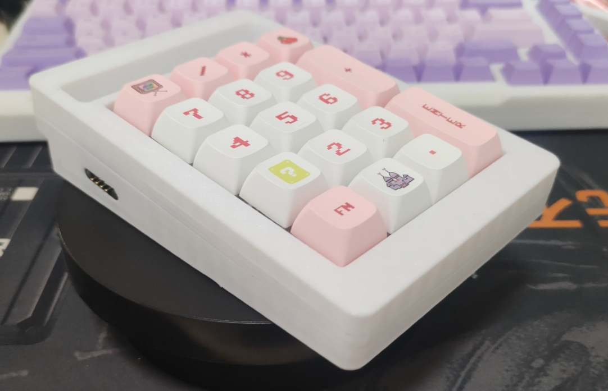

<h1 align="center">TrackPoint78_mini</h1>

<h5 align="center">基于CH582M的三模机械小键盘方案</h5>

TP78是基于CH582M的三模机械键盘方案。以满足带有小红点 便携 无线 自定义快捷键四大根本需求为出发点设计的退烧键盘。基于CH582M三模75%配列，带有小红点(指点杆)，并使用TouchBar实现鼠标左中右键。OLED、Hub和磁吸接口。外壳可使用拓竹A1mini打印拼装。

TP78mini是TP78的标准小键盘扩展模块，可单独三模使用，也可以作为TP78的扩展模块使用，与主键盘共享三模连接方式。

**（注意开源协议，GPL3.0，请尊重开源，欢迎交流，交流群：678606780）**

